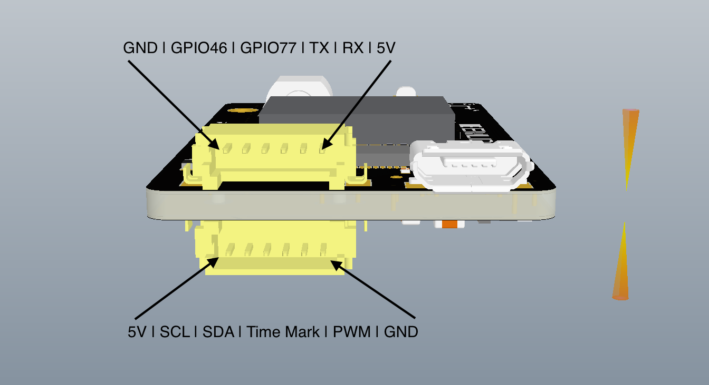

####Maximum ratings

|Name           | Value|
|---------------
|Inout voltage on USB and DF13 conectors:| 4.75-5.5V|
|Logic levels on all pins:| 3.3V|
|Max input voltage on all pins: |5.5V |
|Antenna DC bias| 3.3V|
|Antenna output current| 100 mA|
|Max current consumption @5V:|500mA|
|Normal current consumption @5V:| 200ma|
|Current limit on USB OTG | 1000mA|

####Connectors pinout

* GPIO46, GPIO77, PWM, SCL, SDA, TX, RX are conected to Intel Edison via buffers and are 3.3V logic level, 5V tolerant.
* Time Mark input is connected directly to U-blox chip for low latency, it includes an overvoltage clamp.

####USB OTG

Reach can both receive power from USB, acting as a device and source power to the port acting as a host. To use Reach in OTG mode you will need to connect 5V power source to DF13 connector pins (5V, GND)

