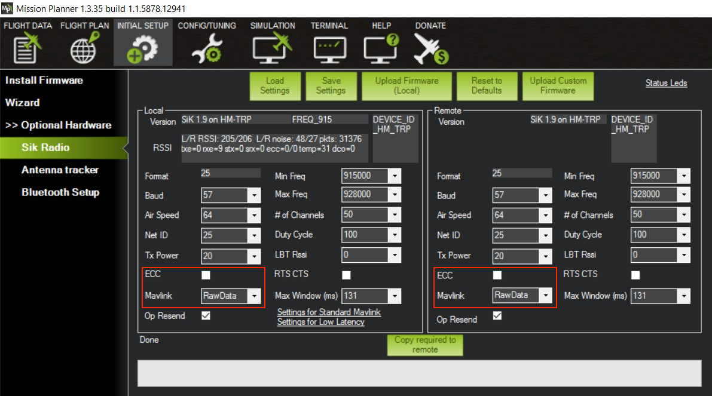
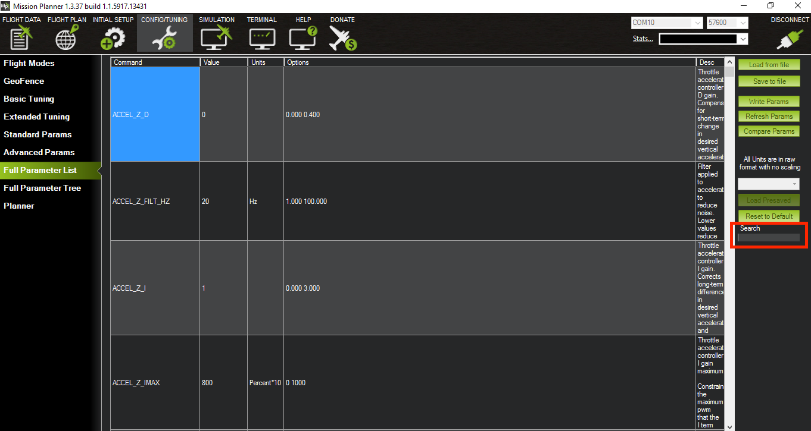
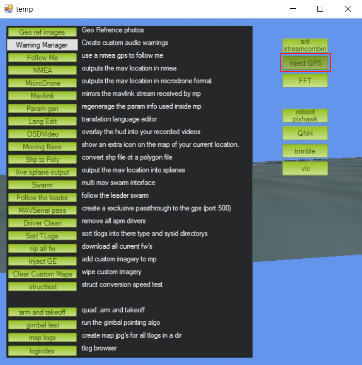
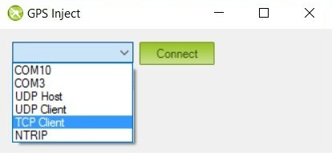
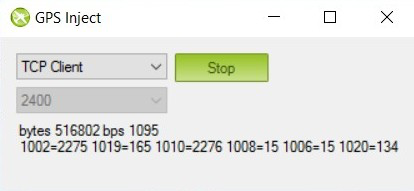

### APM integration

Since ReachView version **0.3.0** Reach supports RTK-enhanced coordinates output to Navio and Pixhawk autopilots. To make this possible, we implemented a custom gps protocol we call **ERB**(Emlid Reach Binary protocol).

Here is a demo video with our results:
<iframe width="560" height="315" src="https://www.youtube.com/embed/oq9H19ikAdM" frameborder="0" allowfullscreen></iframe>

#### ERB Protocol specification

Protocol description is available [here](https://files.emlid.com/ERB.pdf).

#### Pixhawk binaries

Although **ERB** support has already been added to APM master, there was no release yet to include it. Therefore we provide stable binaries with ERB support for all the APM supported vehicles.

* [Pixhawk firmware compatible with ERB](https://files.emlid.com/apm/px4-reach.zip)

#### Recommended setup

The setup we recommend goes as follows:

* Base stations is a Reach unit in Wi-Fi AP mode, configured as a TCP server
* GCS is a laptop with Mission Planner(version 1.3.35 and higher), connected to the base Reach Wi-Fi hosted network
* Telemetry connection via a serial radio
* Rover Reach unit is mounted on a drone and connected to Pixhawk via the 6P-to-6P wire. This connection type will solve three problems at once: power Reach, allow Pixhawk to pass base corrections and allow Reach to pass RTK solution back.

The following guide will show how to configure both Pixhawk and Reach to work in this setup. If you wish alter to this workflow, it should be fairly easy to do so, as every part of the system is independent of others.

#### Connecting Reach to Pixhawk

To provide RTK solution to Pixhawk, Reach needs to be connected via a serial port. You can do that by plugging the serial cable into Reach's upper DF13 port and Pixhawk's **"Serial 4/5"** connector.

#### Configuring Reach to work with Pixhawk

> The serial connection is used to accept base corrections and send solution at the same time.

Start with **"reach_kinematic_default.conf"** configuration file. For both **Input source for base corrections** and **Solution output**(either 1 or 2) do the following:

* Select **Serial**
* Choose **UART** as the serial device
* Choose the desired baud rate(38400 for default)
* Choose **RTCM3** as base corrections format
* Choose **ERB** as solution output format

**ERB** is a custom protocol, used to send location data to the autopilot.

To load these settings, hit the **Save** button at the top, then agree to load the configuration onto Reach.

#### Setting up a correction link

Reach supports a number of ways to accept [base corrections](reachview-link.md), including the popular in UAV area serial radios. However, having a separate radio link for base corrections only is highly ineffective.

To solve this, you can use the telemetry radio as a carrier for RTK corrections. GCS can pass these corrections to the autopilot with a feature called **GPS inject**. This funcionality is available in **Mission planner** only.

##### Configuring radio for embedding corrections into telemetry

With default settings radio telemetry is not optimised for sending RTK corrections. This may cause correction data delivery delays and even loss. These slips will deteriorate RTK solution quality, so we need to minimize them.

> Radio configuration is done with telemetry disconnected.

To change radio settings, make sure **Mavlink connection is disabled**. Then, go to **Initial setup** menu, and select **Sik Radio** in the side menu. Click **Load settings** and wait for the parameters of both radios to load.

You need to clear the field **ECC** and choose **Raw Data** in the Mavlink select field.

After this, click **Save settings**. If your radio's firmware is outdated, update with **Update Firmware(Local)**.

##### Configuring Pixhawk to accept Reach solution

> It is recommended to use Reach as a second GPS unit only.

Pixhawk configuration will require setting some parameters via Mission planner. After connecting, go to **CONFIG/TUNING** menu, then click **Full parameters list** on the left. To find the desired parameter more quickly, use a search box on the right(highlighted in red).

Start with settings **GPS-TYPE2** parameter to **"1"** - AUTO. This will enable the second GPS input.

Next, set **SERIAL4_BAUD** parameter to the same baud rate, as chosen in ReachView solution output. Note the options corresponding to the different baud rates.

Set **GPS_AUTO_SWITCH** to **"1"** - Enabled. Pixhawk will automatically switch between the two GPS receivers, picking the one with better solution.

Finally, set **GPS_INJECT_TO** parameter to **"1"**. **"1"** here stands for the second GPS input. If you configured Reach as the first input, set this parameter to **"0"**.

##### Configuring Mission planner to inject RTK corrections into telemetry

To enable and configure GPS inject options in Mission planner press **"ctrl+F"** button combination. This will open a window with advanced GCS settings. Click **Inject GPS** button on the right.

In the new window, choose parameters for base connection. Reach in base mode supports TCP and serial modes. For the sake of this example, **let's assume base corrections are coming from another Reach in base TCP server mode**. This is a setup we usually use in our test flights.

In order to connect, choose TCP client mode in Mission Planner.

Enter Base Reach's IP address.

And port the server port number.

Finally, check the corrections are coming in.

