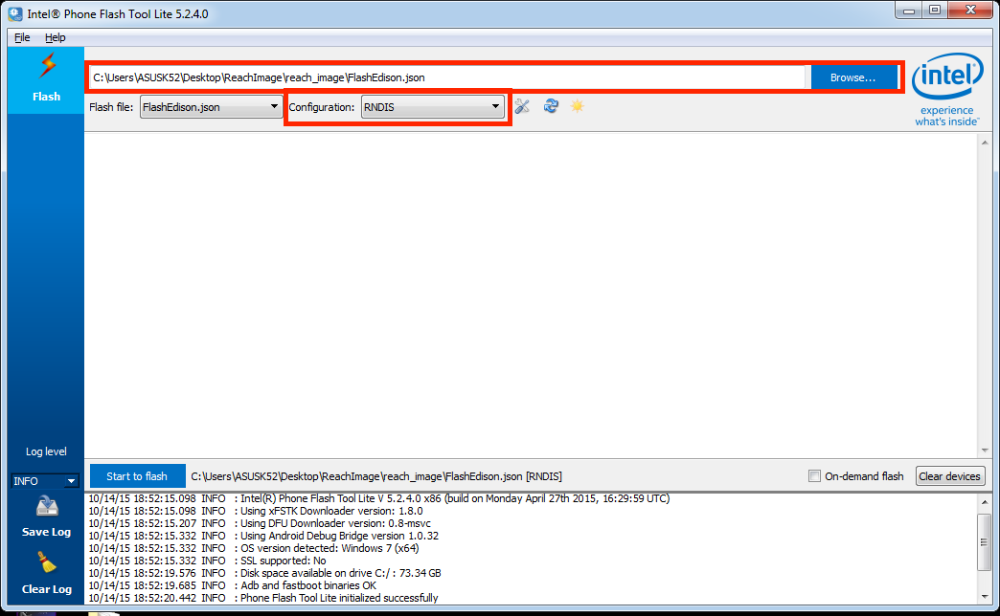
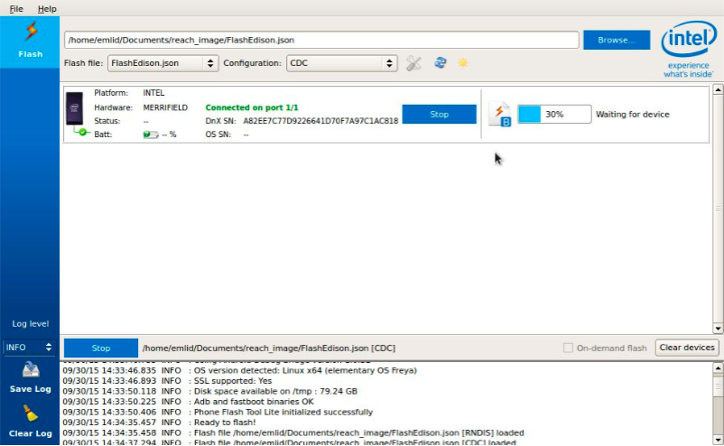

### Firmware reflashing

On this page you will find the information on how to reflash Reach firmware.
Please note that you don't need to do this unless you want to bring Reach to its initial state or new firmware image version is released.
Most new features are released via ReachView app updates that can be updated simply by pressing an "Update" button in its interface.
More information on how to update ReachView app is available in [ReachView App docs section](/Reach/reachview-app/reachview-app/).

#### Getting Emlid Reach Image

We provide a special, enhanced Intel Edison image with following changes:

* Pre-installed software, including RTKLIB, ReachView, socat and more
* WiFi-setup service(Creates an access point, if no known WiFi networks are found)
* Created user "reach" with set up passwords, permissions, etc.

While Reach units are flashed before shipping, we plan to update the image in the future. You can get the latest version [here](http://emlid.com)

There are two ways to flash the image. Intel's GUI Phone Flash Tool Lite and a CLI script.

#### Flashing Reach from GUI

##### Getting Intel Phone Flash Tool Lite

You can get the tool [here](https://software.intel.com/ru-ru/iot/hardware/edison/downloads). It is available for Windows, Mac and Linux. If you are running Windows, you will also need to install the drivers provided on the same page.

##### Flashing Reach

Before flashing:

1. Unzip the image
2. Open the Phone Flash Tool Lite
3. Choose correct path to the unzipped image(You will need to point it to a **.json** file inside)
4. Choose correct USB drivers. RNDIS for Windows, CDC for Mac and Linux

After this:

1. Unplug Reach if it is plugged to this computer
2. Hit the blue **Start to flash** button
3. Plug Reach in
4. Monitor progress

##### After flashing

After flashing Reach will reboot and start self-tests and initial setup. This will be signalised with the onboard LED. Sometimes this does not happen automatically and you will need to replug it into the power source to continue.

Normal behaviour for a freshly flashed Reach is to go through initial setup(LED will glow white for quite a long time), then create an access point and wait for connections

#### Flashing Reach from Terminal

##### Windows

Before flashing:

* Install Intel Edison drivers
* Unzip downloaded image
* Unplug Reach if it's plugged in

To flash:

1. `cd` into the image directory
2. Run `flashall.bat`
3. Plug Reach in
4. Monitor progress in the terminal window

##### Mac OS X

Before flashing:

* Unzip downloaded image
* Install **[homebrew](http://brew.sh)**
* Install dependencies with `brew install dfu-util coreutils gnu-getopt`
* Unplug Reach if it's plugged in

To flash:

1. `cd` into the image directory
2. Run `sudo ./flashall.sh`
3. Plug Reach in
4. Monitor progress in the terminal window

##### Linux

Before flashing:

* Unzip downloaded image
* Unplug Reach if it's plugged in

To flash:

1. `cd` into the image directory
2. Run `sudo ./flashall.sh`
3. Plug Reach in
4. Monitor progress in the terminal window
