### Required data

This tutorial requires:

* RINEX log from the rover, in this case a copter flying a mission with a camera
* RINEX log from the base station installed in range of 10km near the flying area
* RINEX observations log from the reference station located in range of 100km
* Optional: precise ephemeris and clock files from the IGS

In order to get accurate rover track an exact position of the base should be known. You either need to place base on a point with known coordinate, or determine it by post-processing base against a reference station. It is better if the station is within 100km range, but longer range might work as well. In this case we have a 30 second RINEX log from UK OSNET station just 19km away.  Almost every country has a network of reference stations and observations are usually publicly available. Averaging of single solution does not help increase accuracy, so this step is crucial to get an accurate track.

### Calculating base position

Start RTKLIB RTKPOST software and enter the fields as shown here. If running for the first time you will need to set mode to Static in the options to unlock the fields for base staiton data. You can skip the start time, it is not compulsory. Browse to the rover obs (Rinex from your base Reach), to the base station obs (Rinex from the OSNET or other local provider) and to the nav (Rinex from your base Reach). You can as well add precise ephemeresis and clocks at this stage. They are required for long baselines.

Now proceed to the options and set positioning mode to Static, that will tell RTKLIB that the receiver was stationary. Select used navigation systems and set filter to combined. 

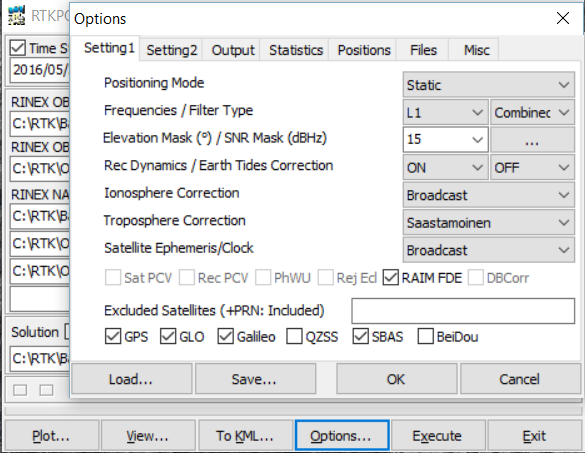

Now switch tab and set GPS AR to Fix-and-hold and Glonass to OFF. Glonass integer ambiguity resolution can be enabled if both base and rover are Reach.

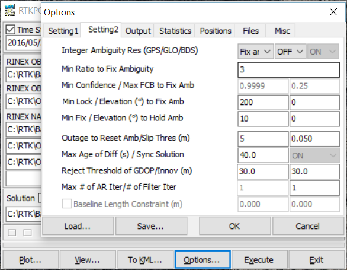

The observations RINEX from the reference station includes exact position in the header file, so we will choose it for the base position. This is very important because it is reference coordinate in the whole post-processing workflow. You need to have one known point to start from.

Now you can hit execute and monitor solution quality, Q=1 means FIX.

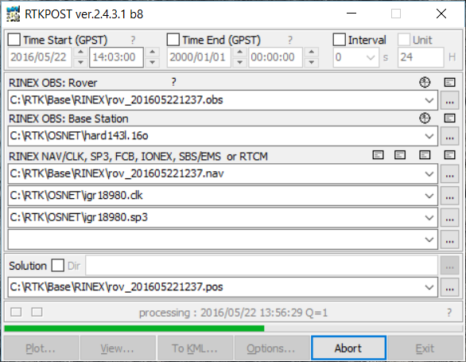

After computation is over press Plot to see the track. We got the base coordinate, write it down we are going to use it in the next step.

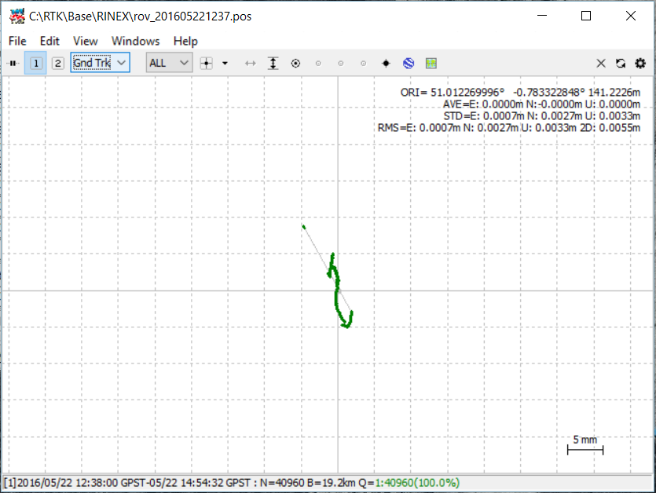

### Calculating rover track

Browse to the rover obs (Rinex from your rover Reach), to the base station obs (Rinex from the base Reach) and to the nav (Rinex from your base Reach). 

Now proceed to the options and set positioning mode to Kinematic, that will tell RTKLIB that the receiver was moving. Select used navigation systems and set filter to combined. Enable dynamic filter as well.

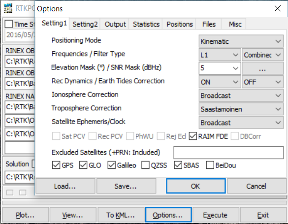

In this case Glonass ambiguity resolution can be set to ON, as both receivers are identical.

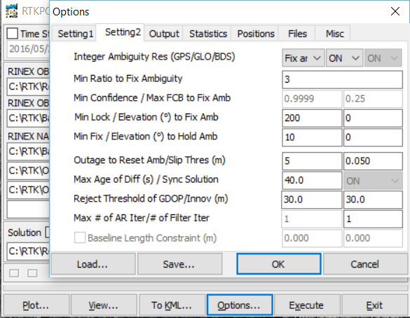

Now we are at the point where we need to enter the coordinates of the base that we have calculated in the previous step.

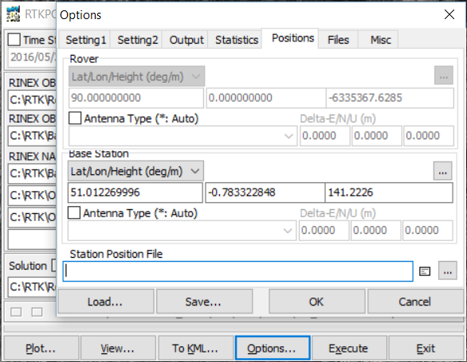

Hit execute and plot the resulting solution. Looks good, but some regions are yellow which indicates float solution. We can look at the observations to try to find the source of the issue.

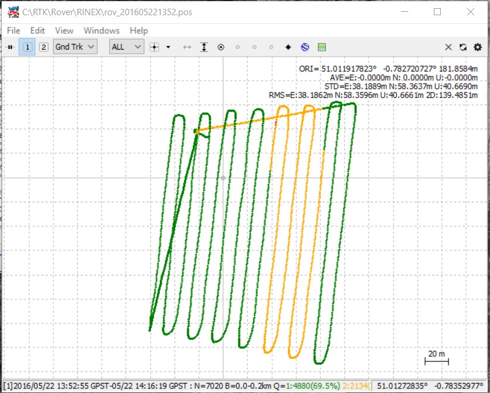

In RTKPLOT go to file-> open observations and select observations from the moving rover. Switch view to satellite visibility. You might need to go to the view options and select all satellite systems and set "cycle slip" to LLI flag to see data like this. We can notice that reception is worse in the beginning, so we can try to crop it to avoid feeding bad data in the filters.

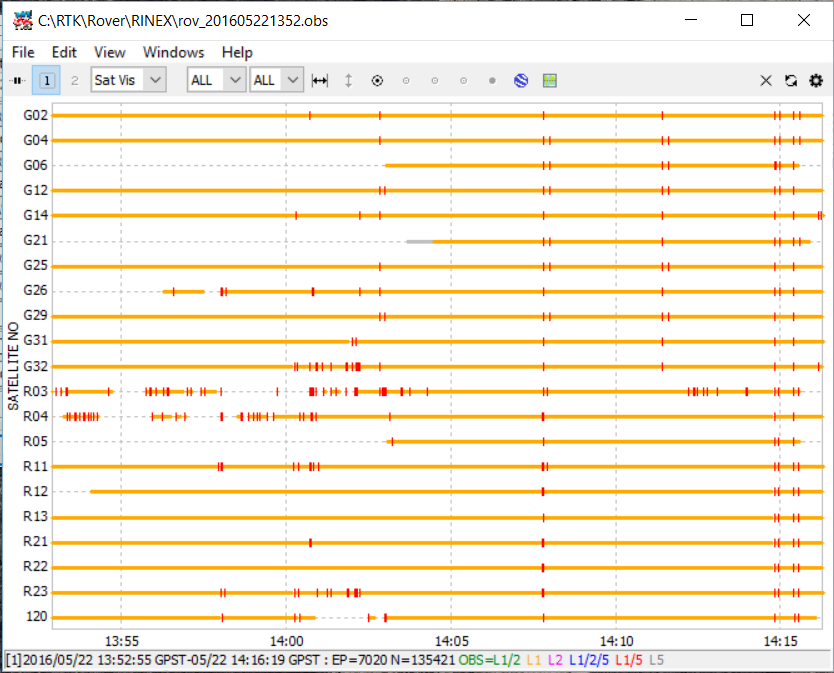

By switching view to Position it is evident that take off is around 14:05 and after this moment signal reception is much better.

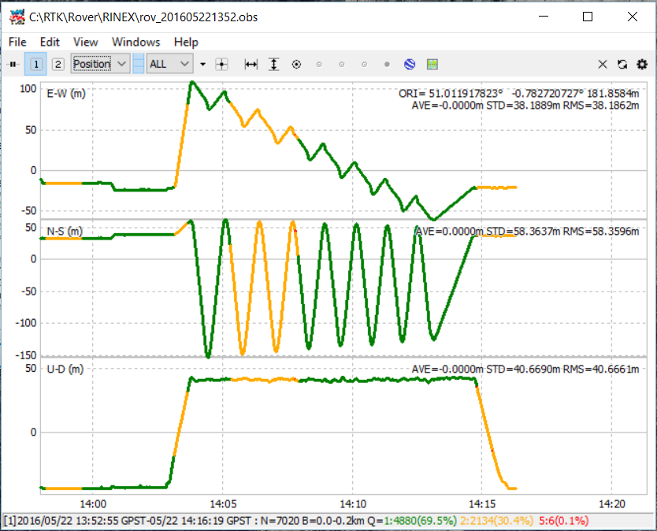

Let's try to process again, but crop data at 14:03.

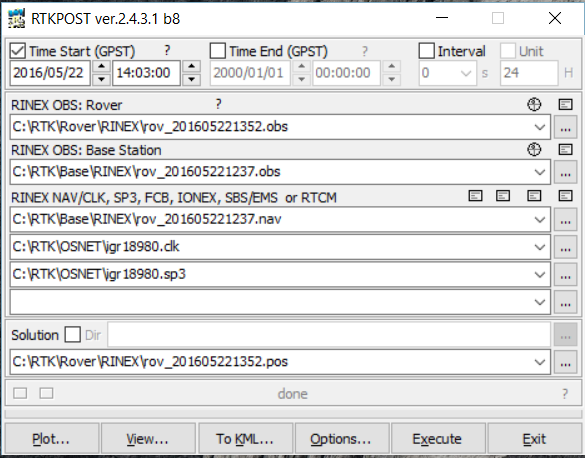

Looks really good now!

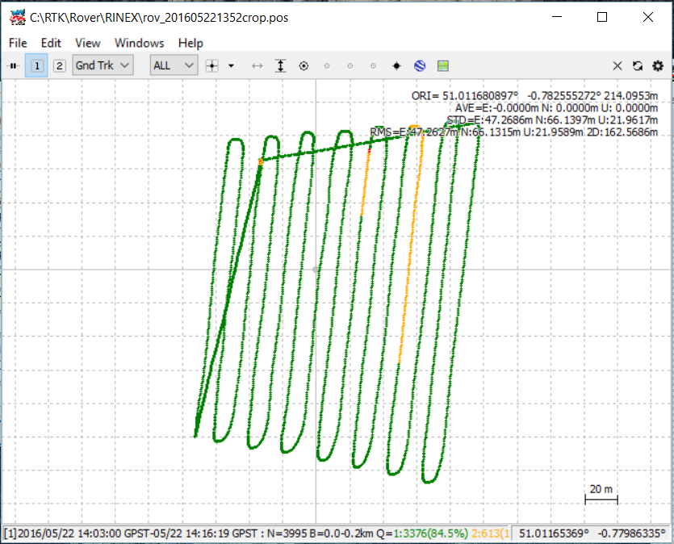

What could have happened if we did not use the exact position of the base, but just averaged single position? This is a close up of three turns, blue track has been processed without exact base position. You can see a shift of several meters.

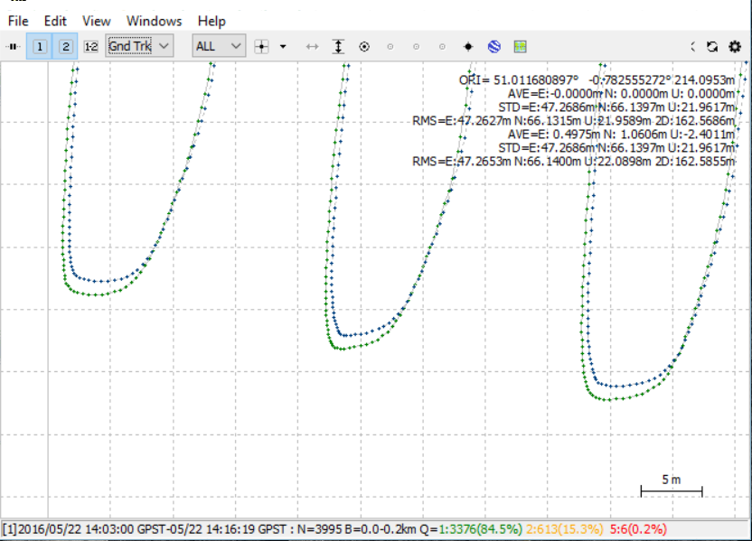

