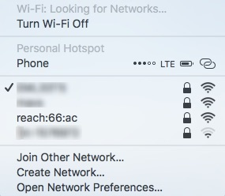
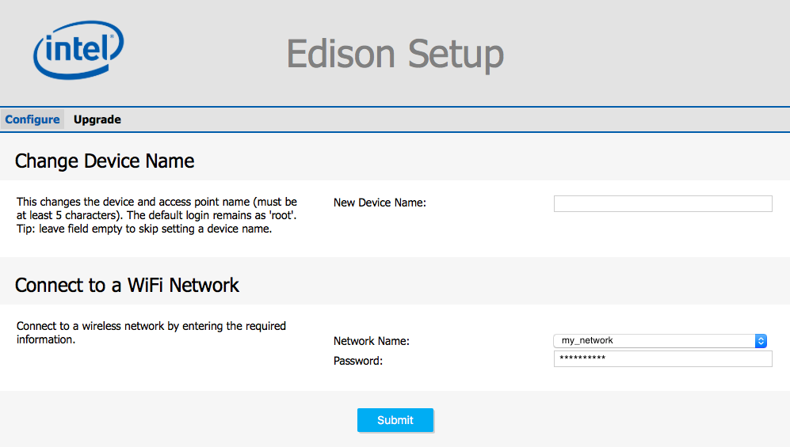
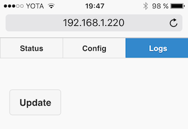

### Setting up Reach networking

#### Powering up for the first time

When Reach is powered for the first time it will create a Wi-Fi hotspot. Open a list of Wi-Fi networks on your smartphone, tablet or laptop and connect to a network named **reach-part_of_mac_address**. Keep in mind that it takes some time for network to show up on your device after it's been created.

For example:

#### Connecting Reach to your Wi-Fi network

After connecting to the network hosted by reach, open a web browser on your smartphone, tablet or laptop and type either **http://reach.local:5000** or **http://192.168.42.1:5000** in the address bar. Choose your Wi-Fi network (e.g. a hotspot on your smartphone) and enter a password. Hit **Submit** and wait for a minute. Reach will disable its own hotspot and try to connect to your Wi-Fi network.

***Repeat all previous steps for both Reach devices.***

#### Resolving IP address

After connecting Reach to an existing network, you will need to find it's IP address.

Good to remember:

* If you are on Reach's self-hosted network, it's IP is always **192.168.42.1**
* If there is only one Reach unit on the network, it should be accessible by **reach.local** address

If these are not the case, you will need to scan your local network. In most of these apps, Reach units will show up as **Murata Manufacturing Co.** device.

* You can use the **Fing app** to scan your local network from your phone
* You can use **nmap** to scan your local network on Linux/Mac OS X. Nmap is cli tool available through most package managers like [homebrew](http://brew.sh) on Mac and **apt-get** on Debian based Linux distributions. Example of using nmap to perform host discovery would be `sudo nmap -sn 192.168.1.0/24`
* On Windows, you can use **Zenmap**, which is a GUI for **nmap** or use any other third-party network scanners.

For example - a screenshot of fing running on an iPhone:

### Working with ReachView app

#### Connecting to ReachView

Once you have the address, enter it into a browser. The app should work on most reasonably modern browsers, including those in phones and tablets.

The first thing you should see is a status tab:

***The interface might be updated and look slightly different***

As you can see, the default state for Reach is **stopped Rover**.

#### Interface walkthrough

ReachView consists of three main tabs: **Status**, **Config**, **Logs**. Status will show current satellite levels, solution status and coordinates. Config tab is used to set RTKLIB parameters like positioning mode, set correction input interface and more. Logs tab keeps links to raw data logs stored on the device and some other miscellaneous useful features.

***It is very important that you perform self-update during your first Reach use.***

#### Updating ReachView

To do this, make sure Reach is connected to a Wi-Fi network with Internet access. Go to the Logs page and press the **Update** button. ReachView will go inactive for about a minute. To reconnect, close the current tab and try to open ReachView in a new one. It is preferred to use Reach's IP address instead of **reach.local** to connect after an update.

***From this point, it is considered that you performed the update.***

#### Setting up base station

Navigate to **Config** tab and choose **Base** mode in the upper selector. Wait for the app to fetch current base settings. The settings include: base coordinates, input stream, output stream and RTCM3 messages to be used. **Input stream** settings must not be changed.

##### Base output settings

Reach in base mode only supports RTCM3 data output.

There are several ways to stream it:

* Serial connection. This option is used for two things: UART connection on the [upper DF-13 connector](hardware-integration.md) and USB devices with serial protocol, like USB radio
* File. It is best to specify `/home/reach/logs/filename` path
* TCP server. Set up a port listening for incoming connections
* TCP client. Connect to a TCP server
* Ntrip client.
* Ntrip server.

##### Base RTCM3 output messages

A number of output messages is supported, you can find more information about them [here](http://www.geopp.de/rtcm-3-x-message-types/).

##### Base coordinates

**This is a key point in getting good results.** Reach in base mode needs to know it's coordinates. Best practice is setting up base on a well-known position(coordinates determined by RTK) as this directly affects positioning results.

Coordinates are entered in llh format. **By default, if no coordinates were entered, Reach in base mode is configured to wait for single solution, get the coordinates and use them as base's position.** Keep in mind that single positioning mode is far less accurate.

Why are base coordinates so important?

To achieve **good absolute positioning** results on the rover, base needs to know it's position accurately. RTK algorithms calculate a vector pointing from base's location(basically, the coordinates you enter here) to rover. Then, rover's absolute position is determined using this vector and base coordinates. That means that rover's **absolute** position will be just as accurate as the base's **absolute** coordinates.

However, if you are only interested in rover's **relative** position accuracy, you may use a less accurate position for the base.

#### Setting up rover

Navigate to **Config** tab and choose **Rover** mode in the upper selector. Wait for the app to fetch current rover settings.

###### Working with configuration files

Unlike the base mode, rover has a lot more settings to work with and uses **configuration files** to store them.

TODO: Screenshot

You may choose the configuration file from the dropdown menu. Reach comes with several pre-defined default configs, such as **reach\_single\_default.conf** and **reach\_kinematic\_default.conf**. The menu(three dot) button allows to reset these configs to initial state, so you are free to mingle around in them. You can also copy them using "**Save As..**" button.

The settings you see in rover mode are an exact mirror of RTKLIB's **rtkrcv** configuration files. They contain a lot of parameters, and all of them are available under the **Advanced settings** button. Some of these parameters retain original names as they are defined in **rtkrcv** configuration files.

You can read everything about these settings in [RTKLIB docs](http://www.rtklib.com/rtklib_document.htm) in section "Configure Positioning Options for RTKNAVI and RTKPOST".  

By default you can only see the most important ones:

* Positioning mode
    * Single. The result relies only on the on-board GPS unit. Base corrections will not be used in positioning
    * Kinematic. Base corrections will be used to improve positioning. The rover is assumed to be moving. This is the main RTK mode
    * Static. Base corrections will be used to improve positioning. The rover is assumed **not** to be moving.
    *
* Input source for base corrections. Specify the path to base corrections stream. Most common options include:
    * TCP client with an IP and port
    * Serial connection. Use **ttyUSB0** for USB devices and **ttyMFD2** and baudrate for UART devices
    * NTRIP client
* Output solution paths. You can output solution data in several formats, like llh, xyz, nmea or enu. You can use the same UART port(**ttyMFD2**) for both base correction input and solution data output
* Log paths. By default, logs are written to a file stored locally. It is later available for download from the **Logs** tab

Under **Advanced settings** you can see much more parameters for fine-tuning RTK performance.

When you are done with the settings, hit the **SAVE & LOAD** button. This will start the calculations and writing the raw data log. Proceed to the **Status** tab to check your setup.

*TODO*
Set up a correction stream.

#### Viewing results

**Status** tab is the place to monitor current state of the positioning solution. First thing you see is a chart showing rover's satellite levels. Good reception of the satellite signal is essential for RTK technology to be able to produce a good positioning solution. This chart is intended to help with antenna placement. If you are in mode that involves base corrections and the input is setup correctly, you will see base satellite levels as well. The grid above the chart shows current state as the current positioning mode, solution status and coordinates in llh format.

The solution status value(simply labeled **status** in the grid) is the key value you can see here. After you have started the rover, you will be able to get the following solution statuses(probably in this order):

* **"-"**. This means there is not information for the software to process. Either not enough time has passed or the antenna is poorly placed
* **single**. This is usually the state that follows **"-"** in RTK mode. **Single** means that rover has found a solution relying on it's own receiver and base corrections are not taken into consideration yet. If rover is started in single mode, this will also be the result
* **float**. The base corrections are now taken into consideration and positioning is relative to base coordinates, but the integer ambiguity is not resolved
* **fixed**. Positioning is relative to the base and the integer ambiguity is properly resolved. This is as good as it gets, **fix** solution status indicates high level of positioning precision

*TODO*
Wait for Float status, then for Fix. LED statuses

#### Output: logs and solution

Reach supports outputting two types of data: **raw data logs** and processed **solution**.

**Raw data logs** contain all the messages sent by base and rover receivers. These logs can be used later for post-processing. On the contrary, **solution** is a stream of already processed and enhanced coordinates. Available solution formats include llh, xyz, nmea and enu.

By default, all **raw data logs** are saved as files on the device and are available for download on ReachView's **Logs** tabs.

*TODO*
Logs can be used for post-processing.
