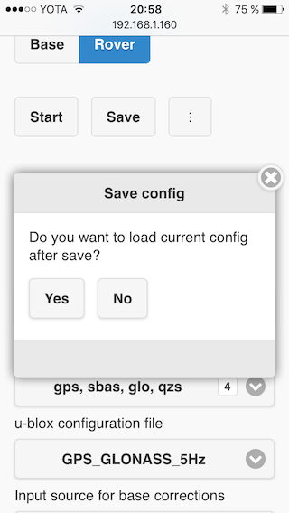

#### Setting up rover

In RTK terminology, **Rover** is the receiver that moves and gets it's coordinates enhaced via corrections coming from a **Base** unit. To configure Reach as a Rover, navigate to **Config** tab and choose **Rover** mode in the upper selector. Wait for the app to fetch current rover settings.

###### Working with configuration files

Rover unit does all the RTK-related calculations and therefore has a lot of settings. These settings are organized into configuration files, which can be browsed in the **Config** tab of ReachView. Some of them are available directly below the config selector, the rest hidden under an **Advanced settings** button at the bottom.

On the screenshot below you can see Reach in rover mode with "reach_single_default.conf" config file chosen.

Reach comes with several predefined, default configs, which are updated regularly. You are free to edit and use them, however they will be reset with each update.

The three-dot menu provides some additional functionality with these files, such as an ability to reset a config to default or copy it using **Save as...**.

> Selecting a different config file does not mean it's loaded on the device.

**To load a configuration file to Reach**, press "**Save**" and then "**Yes**" in the popup window.

###### RTK & GNSS parameters

* Positioning mode
    * Single. The result relies only on the on-board GPS unit. Base corrections will not be used in positioning
    * Kinematic. Base corrections will be used to improve positioning. The rover is assumed to be moving. **This is the main RTK mode**
    * Static. Base corrections will be used to improve positioning. The rover is assumed **not** to be moving.
* Used positioning systems. Choose what systems will be used by the RTK engine.
* u-blox configuration file. Configure onboard receiver modes, including update rate and GNSS systems.

###### Correction link and outputs

These settings deserve separate chapters, [here](reachview-link.md) and [here](reachview-output.md).

###### Advanced settings

Under **Advanced settings** you can see much more parameters for fine-tuning RTK performance.

You can read everything about these settings in [RTKLIB docs](http://www.rtklib.com/rtklib_document.htm) in section "Configure Positioning Options for RTKNAVI and RTKPOST".

#### Setting up base station

**Base** mode allows Reach to send RTK corrections in a number of ways.

###### Base output settings

Reach in base mode only supports RTCM3 data output.

There are several ways to stream it:

* Serial connection. This option is used for two things: UART connection on the [upper DF-13 connector](hardware-integration.md) and USB devices with serial protocol, like USB radio
* File. It is best to specify `/home/reach/logs/filename` path
* TCP server. Set up a port listening for incoming connections
* TCP client. Connect to a TCP server
* Ntrip client.

###### Base RTCM3 output messages

A number of output messages is supported, you can find more information about them [here](http://www.geopp.de/rtcm-3-x-message-types/).

###### Base coordinates

**This is a key point in getting good results.** Reach in base mode needs to know its coordinates. Best practice is setting up base on a well-known position (coordinates determined by RTK) as this directly affects positioning results.

Coordinates are entered in llh format. **By default, if no coordinates were entered, Reach in base mode is configured to wait for single solution, get the coordinates and use them as base's position.** Keep in mind that single positioning mode is far less accurate.

Why are base coordinates so important?

To achieve **good absolute positioning** results on the rover, base needs to know its position accurately. RTK algorithms calculate a vector pointing from base's location (basically, the coordinates you enter here) to rover. Then, rover's absolute position is determined using this vector and base coordinates. That means that rover's **absolute** position will be just as accurate as the base's **absolute** coordinates.

However, if you are only interested in rover's **relative** position accuracy, you may use a less accurate position for the base.

