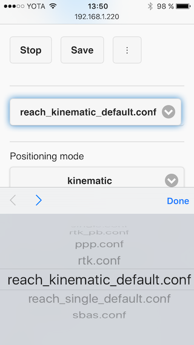

#### Setting up rover

Navigate to **Config** tab and choose **Rover** mode in the upper selector. Wait for the app to fetch current rover settings.

###### Working with configuration files

Unlike the base mode, rover has a lot more settings to work with and uses **configuration files** to store them.

You may choose the configuration file from the dropdown menu. Reach comes with several pre-defined default configs, such as **reach\_single\_default.conf** and **reach\_kinematic\_default.conf**. The menu (three dot) button allows to reset these configs to initial state, so you are free to mingle around in them. You can also copy them using "**Save As..**" button.

###### Configuration parameters

The settings you see in rover mode are an exact mirror of RTKLIB's **rtkrcv** configuration files. They contain a lot of parameters, and all of them are available under the **Advanced settings** button. Some of these parameters retain original names as they are defined in **rtkrcv** configuration files.

By default you can only see the most important ones:

* Positioning mode
    * Single. The result relies only on the on-board GPS unit. Base corrections will not be used in positioning
    * Kinematic. Base corrections will be used to improve positioning. The rover is assumed to be moving. This is the main RTK mode
    * Static. Base corrections will be used to improve positioning. The rover is assumed **not** to be moving.
* Used positioning systems. Choose which GNSS are used
* Base antenna coordinates. Default value is "rtcm", meaning base is broadcasting its coordinates

###### Data streams

There is a number of data streams to be configured: base input, solution and logs.

* Base input stream is the way to get base corrections
* Logs, or raw data streams, contain receiver's output and can be later used for post-processing
* Solution is location information extracted from processed raw data

All these streams have a number of paths to directed to. Some paths are common, some paths are specific to the stream type.

Common stream paths include:

* Serial connection. For Reach's UART port use "**ttyMFD2**" device and a baud rate of the connected accessory. For USB devices, use "**ttyUSB0**" and a random baud rate (it will be ignored)
* TCP server. Listen to TCP connections on a specified **port**
* TCP client. Connect to TCP server listening on a certain **IP address** and **port**
* File. Specify a **path to a file** on Reach. This is particularly useful for logs. By default, when you choose log output path to be a file, you get a default path to a file which contains current date and time mask. Writing logs to this default file path will make them available in the **Logs** tab later (refresh page after stopping rover)

Paths, specific to input stream:

* NTRIP client. Connect to a NTRIP caster. You will need an **address** and a **port**, some casters also require a **login** and a **password**
* http. Enter a **URL**
* ftp. Enter a **URL**

Paths, specific to output streams:

Under **Advanced settings** you can see much more parameters for fine-tuning RTK performance.

When you are done with the settings, hit the **SAVE & LOAD** button. This will start the calculations and writing the raw data log. Proceed to the **Status** tab to check your setup.

You can read everything about these settings in [RTKLIB docs](http://www.rtklib.com/rtklib_document.htm) in section "Configure Positioning Options for RTKNAVI and RTKPOST".

#### Setting up base station

Navigate to **Config** tab and choose **Base** mode in the upper selector. Wait for the app to fetch current base settings. The settings include: base coordinates, input stream, output stream and RTCM3 messages to be used. **Input stream** settings must not be changed.

##### Base output settings

Reach in base mode only supports RTCM3 data output.

There are several ways to stream it:

* Serial connection. This option is used for two things: UART connection on the [upper DF-13 connector](hardware-integration.md) and USB devices with serial protocol, like USB radio
* File. It is best to specify `/home/reach/logs/filename` path
* TCP server. Set up a port listening for incoming connections
* TCP client. Connect to a TCP server
* Ntrip client.

##### Base RTCM3 output messages

A number of output messages is supported, you can find more information about them [here](http://www.geopp.de/rtcm-3-x-message-types/).

##### Base coordinates

**This is a key point in getting good results.** Reach in base mode needs to know its coordinates. Best practice is setting up base on a well-known position (coordinates determined by RTK) as this directly affects positioning results.

Coordinates are entered in llh format. **By default, if no coordinates were entered, Reach in base mode is configured to wait for single solution, get the coordinates and use them as base's position.** Keep in mind that single positioning mode is far less accurate.

Why are base coordinates so important?

To achieve **good absolute positioning** results on the rover, base needs to know its position accurately. RTK algorithms calculate a vector pointing from base's location (basically, the coordinates you enter here) to rover. Then, rover's absolute position is determined using this vector and base coordinates. That means that rover's **absolute** position will be just as accurate as the base's **absolute** coordinates.

However, if you are only interested in rover's **relative** position accuracy, you may use a less accurate position for the base.

