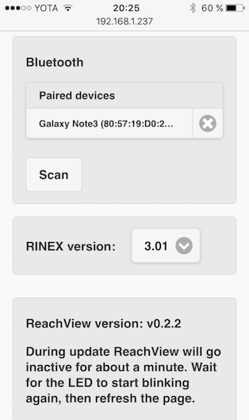
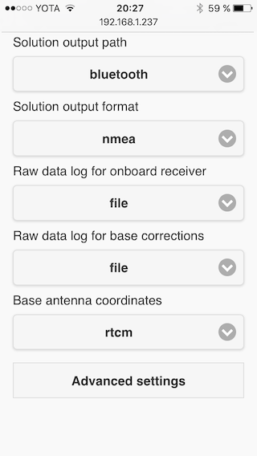
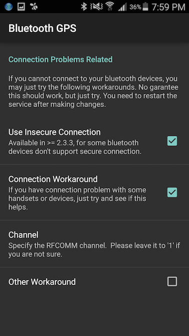
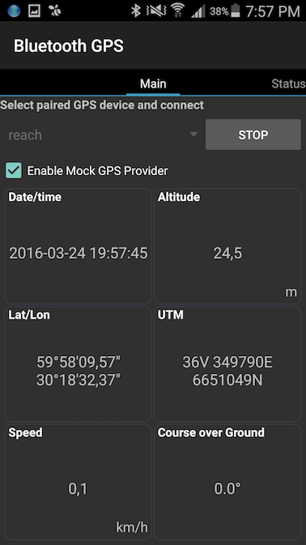
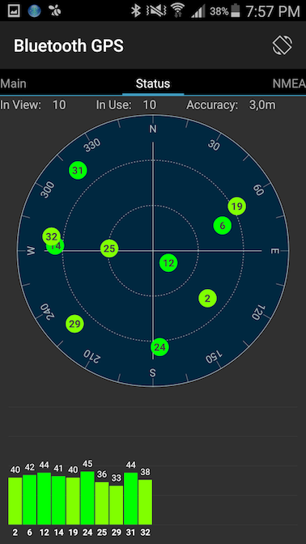

### Solution output and logging

In Rover mode, Reach supports outputting two types of data: **raw data logs** and processed **solution**.

**Raw data logs** contain all the messages sent by base and rover receivers. These logs can be used later for **post-processing**.
By default, all raw data logs are saved as files on the device and are available for download on ReachView's **Logs tabs**.

On the contrary, **solution** is a stream of already processed and enhanced coordinates. Available solution formats include llh, xyz, nmea and enu. Solution can be used for **plotting a track** with RTKLIB's RTKPLOT.

### Logging options

Raw data logs have several destinations available:

* **File**. Logs are to be saved on device directly
* **Tcp server or client**. This can be used if you are interested in remote network logging
* **Serial**. You can direct the log stream to a UART or USB serial device, like a radio
* **Bluetooth**. Bluetooth can also be used to output raw data

###### Logging to a file

Naturally, logging to a file is the most common use case. With "Raw data log" options set to **file**, Reach will start logging as soon, as you press start in Rover mode and will continue, until you stop it or Reach will be powered down.

All logs, written to a file, are available in the logs tab. Clicking a log in the list will first convert the raw log to **RINEX**, then download it. Although Reach is based on a powerful dual-core x86 processor, log conversion may take a little while.
Cross button on the right will delete the log from device.

During the conversion process you will see a countdown timer. For really big logs, conversion can take unreasonably long time. To handle this, the **delete button becomes cancel**. If you hit **cancel**, conversion will stop and log will be downloaded as it is.

Note that you can change RINEX version to convert to in the **settings tab**.

### Solution output options

> Solution output allows RTK enhanced coordinates to be passed on in **llh, xyz, enum, nmea and erb** formats

Just as with raw data logging, solution can be directed to the same destinations

* **File**. Solution files are also available via the logs tab
* **Tcp server or client**. A nice way to monitor your results is connecting via RTKPLOT later
* **Serial**. USB or UART serial devices, like 3DR radio
* **Bluetooth**. This is a special option as it allows **Reach solution to be used on Android devices as a location source**. This is known as "mock location".

###### Passing RTK solution to an APM autopilot

> Since ReachView version **0.3.0** Reach adds support to output RTK solution to Navio and Pixhawk autopilots

To do this, simply select **erb** solution output **format** in the ReachView configuration tab. Read more on APM integration here.

###### Bluetooth output and Android mock location

Since version **v0.2.2** of ReachView, you can choose bluetooth as an output for both raw logs and solution. However, the beauty of this feature is that it can be used with an Android app called [Bluetooth GPS](https://play.google.com/store/apps/details?id=googoo.android.btgps&hl=en). This app allows an external GPS receiver connected via bluetooth, to be used as an internal Android location provider.

To use the Bluetooth GPS app with Reach you need to do the following:

* Pair your Android device with Reach.

To do this, make your device discoverable. Then, go to the **Settings tab** and hit scan in the bluetooth section. Once your device appears in the "discoverable" section, hit it to send a pairing request. Accept the pairing request on your device. Your device will appear in the "paired devices section".

* Set "Solution output" to bluetooth and "Solution format" to **NMEA**.

* Open up **Bluetooth GPS** and go to the settings. To connect to Reach, you will need to set an option called "Connection workaround"

* Go to the main screen, choose "reach" in the device list and hit "Connect"

* Enjoy your RTK data!

